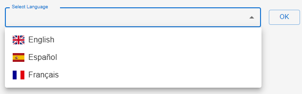

# summary-ai

summary-ai is a full-stack news articles summarizer that leverages modern AI tools. The backend uses Flask, LangChain, and OpenAI to scrape, summarize, and translate news articles. The frontend (built in React) provides an interactive interface for language selection, article listing, and detailed article views.

## Index
- [Backend Functionality](#backend-functionality)
- [GET API Services](#get-api-services)
- [Requirements](#requirements)
- [Installation Instructions](#installation-instructions)
- [Environment Variables](#environment-variables)
- [Frontend](#frontend)
- [Docker & Docker Compose](#docker)
- [Screenshots](#screenshots)

## Backend Functionality

The backend is built with Flask and is responsible for:
- **Scraping Articles:** Using newspaper3k to extract titles and texts from news URLs.
- **Summarization:** Using LangChain and OpenAI (via ChatOpenAI) to generate concise summaries of articles. It supports translations by receiving a language parameter.
- **News Fetching:** Integrates with a free news API to provide top articles for various categories (Tech Trends, Crypto Financial News, International Conflicts).
- **Endpoints:** Exposes several GET endpoints for languages, news categories, top news, and detailed article summarization.
- **Error Handling & Logging:** Uses try/catch blocks and a dedicated logging utility to ensure issues are well documented.
- **Isolation:** Business logic is isolated in service classes for ease of debugging and future maintenance.

## GET API Services

| Endpoint                                  | Parameters                                                      | Output Format                                                                                                                                                      |
| ----------------------------------------- | --------------------------------------------------------------- | ------------------------------------------------------------------------------------------------------------------------------------------------------------------ |
| `/api/languages`                          | None                                                            | Array of language objects. Example: `[{"id": "EN", "label": "English"}, {"id": "ES", "label": "Español"}, {"id": "FR", "label": "Français"}]`                 |
| `/api/categories`                         | None                                                            | Array of category objects. Example: `[{"id": "tech", "label": "Tech Trends"}, {"id": "crypto", "label": "Crypto Financial News"}, {"id": "conflict", "label": "International Conflicts"}]` |
| `/api/news/top?lang=<LANG_CODE>`           | `lang`: language code (e.g. `EN`, `ES`, etc.)                     | Array of articles. Each article has keys: `title`, `category`, and `link`. Example: `[{"title": "Article Title", "category": "tech", "link": "http://..."}, ...]`      |
| `/api/news?link=<ARTICLE_LINK>&lang=<LANG>` | `link`: URL of the news article `lang`: language code (default `EN`) | An object with the article's `title` and `content` (the generated summary). Example: `{"title": "Article Title", "content": "Summary text..."}`                      |

## Requirements

You will need an OpenAI API key and a [NewsAPI](https://newsapi.org/) key before running the project.

The project uses the following libraries:

- Flask  
- newspaper3k  
- python-dotenv  
- langchain  
- openai  
- pytest  
- langchain-openai  
- "lxml[html_clean]"

## Installation Instructions

1. **Clone the repository:**

`` 
git clone https://github.com/hector-oviedo/summary-ai
``

2. **Navigate to the backend folder:**

`` 
cd summary-ai/backend
``

3. **Create a virtual environment and activate it (optional but recommended):**

`` 
python -m venv venv
source venv/bin/activate  (or venv\Scripts\activate on Windows)
``

4. **Install the required dependencies:**

`` 
pip install -r requirements.txt
``

5. **Create a `.env` file in the backend directory with the following content:**

`` 
OPENAI_API_KEY=your_openai_api_key
NEWS_API_KEY=your_news_api_key
``

6. **Run the Flask application locally:**

`` 
python main.py
``

The backend API will be available at `http://127.0.0.1:5000`.

## Environment Variables

The application requires the following environment variables to be set in the `.env` file:

- **OPENAI_API_KEY:** Your OpenAI API key, used for summarization via ChatOpenAI.  
- **NEWS_API_KEY:** Your API key for the chosen news service, used to fetch news articles.

This setup ensures that summary-ai runs locally with all necessary configuration. The backend handles article scraping, summarization (with language translation support), and serves the data through RESTful endpoints.

## Frontend

### Frontend Overview
The frontend is built with React using Vite and Material UI. It provides an interactive interface for:

- Selecting a language (with flag icons for top 10 languages)
- Viewing a list of top news articles (with alternating backgrounds and smooth roll-over effects)
- Reading detailed article summaries in a styled card layout with proper error handling and loading indicators
- Responsive design: on extra small devices the layout spans 12 columns, on small devices 10 columns, and on medium and larger devices 6 columns, all centered vertically and horizontally

### Installation & Running

Navigate to the frontend folder:

``
cd summary-ai/frontend
``

Install dependencies:

``
npm install
``

Run the development server:

``
npm run dev
``

The frontend will be available at `http://localhost:5173`.

### CORS Issue & Workaround

Due to CORS restrictions in modern browsers, API calls from the frontend (running at `http://localhost:5173`) to the backend (running at `http://localhost:5000`) may fail.
A common workaround for development is to launch Chrome with web security disabled. To do this, run the following command in your terminal:

``
"your-chrome-browser-path\chrome.exe" --disable-web-security --user-data-dir="C:\chrome-dev"
``

Note: This workaround should only be used during development and testing, not in production.

### API Endpoint Configuration
The file `src/services/api.js` contains the base URL for the backend API. By default, it is set to:
`http://localhost:5000`
If your backend is hosted elsewhere or on a different port, update this value accordingly.

## Docker

This project is dockerized for both the backend and frontend. The backend uses Flask (served on port 5000) and the frontend uses Vite preview (served on port 5173).

### Docker Compose Setup

The repository includes a `docker-compose.yml` file with the following configuration:

`` docker-compose.yml
version: '3'
services:
  backend:
    build: ./backend
    ports:
      - "5000:5000"
    environment:
      - FLASK_DEBUG=true
      - OPENAI_API_KEY=your_openai_api_key
      - NEWS_API_KEY=your_news_api_key
  frontend:
    build: ./frontend
    ports:
      - "5173:5173"
``

**Note:** If you encounter warnings about the `version` attribute being obsolete, you can safely ignore them or remove the attribute.

### Building and Running the Containers

To build and start the containers, navigate to the project root and run:

`` docker-compose up --build ``

This command will build the backend and frontend images and start the containers. You can then access:
- The backend API at `http://localhost:5000`
- The frontend at `http://localhost:5173`

### Frontend Dockerfile Configuration

Ensure that the frontend Dockerfile is configured to bind Vite's preview server to `0.0.0.0` on port `5173`. The Dockerfile should look like this:

`` dockerfile
FROM node:18-alpine
WORKDIR /app
COPY package.json package-lock.json* ./
RUN npm install
COPY . .
RUN npm run build
EXPOSE 5173
CMD ["npm", "run", "preview", "--", "--host", "--port", "5173"]
``

This ensures that the Vite preview server is exposed externally. If your preview server logs a URL like `http://localhost:4173`, verify that the `--host` and `--port` flags are correctly set as shown above.

### Cleaning Up Docker Images

To remove existing containers and images (forcing a complete rebuild), run:

`` docker-compose down --rmi all ``

Then, rebuild and start the containers with:

`` docker-compose up --build ``

## Screenshots

